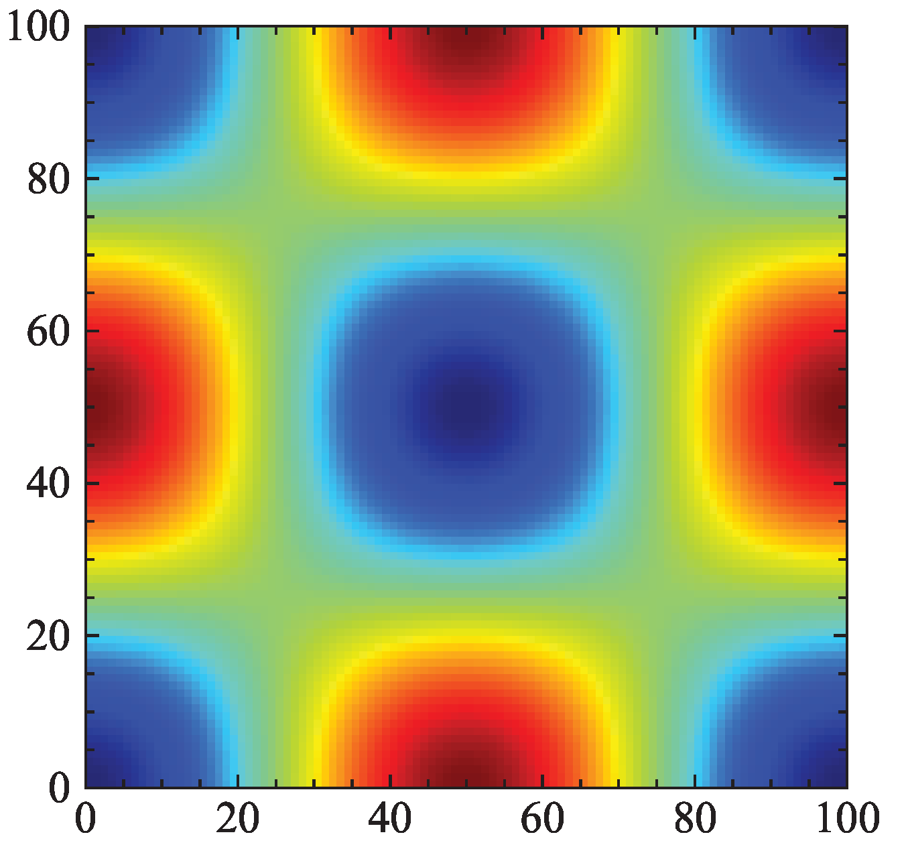

# Recursively-Regularized-LBM
Implementations of recursively regularized LBM for simulating various flows, will be fully availabe after the acceptace of our manuscript.

Currently, methods using 3rd-order equilibrium and 3rd non-equilibrium are available.

- Updates will be made accordingly, including the CUDA-C++ version.

## Taylor-Green vortex flow

## Lid-driven cavity flow

## Laminar channel flow

## Turbulent channel flow
